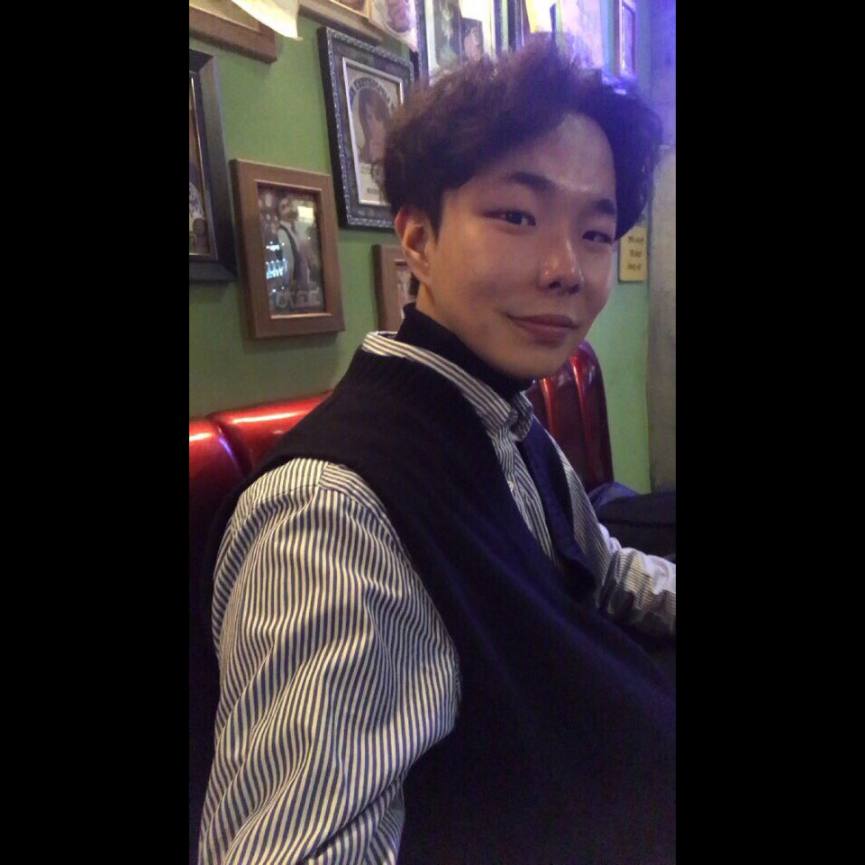

팀 소개 페이지 : https://kookmin-sw.github.io/2019-cap1-2019_6/

## ViewToPia - Be Eyes


***

### 1. 프로잭트 소개

**시각장애인**을 위한 **딥러닝** 기반 스마트 글래스  

***

### 2. 소개 영상

[](https://www.youtube.com/watch?v=kQOd4qONANw&t=3s)

***

### 3. 팀 소개

#### 지도 교수 : 이 시 윤 교수님

#### **박 병 훈**



```markdown
학번 : 20143062
역할 : 프로젝트 팀장 및 Data 처리 훈련, Object Detection & Tracking
Email : byunghoonpark1005@gmail.com
```

#### **김 상 민 ( Sang-Min, Kim )**


```markdown
학번 : 20132368
역할 : Data 처리 훈련, Object Detection & Tracking
Email : ksm372510@gmail.com
```

#### **안 은 영**


```markdown
학번 : 20143075
역할 : Text Reading하기 위한 모션 인식 설정, TTS 기능 구현
Email : any218@kookmin.ac.kr
```

#### **서 준 교**


```markdown
학번 : 20143068
역할 : Text Reading하기 위한 모션 인식 설정, TTS 기능 구현
Email : jkseo50@naver.com
```

#### **이 옥 걸**


```markdown
학번 : 20163142
역할 : 라즈베리파이 환경 설정 및 하드웨어 디바이스 제작
Email : li994885943@gmail.com
```

***

### 4. 사용법

* 제작한 하드웨어 디바이스를 장착하고 카메라가 객체를 인식하도록 장애물에 접근한다.
* 글자를 읽고 싶다면 글자가 있는 곳을 특정 모션을 취한다.

***

### 5. 기타

```markdown
 본 프로젝트는 시각장애인을 위한 딥러닝 기반 스마트 안경을 개발하는 것을 목표로 한다. 

 안경에 부착된 카메라로 영상처리를 하여 시각장애인 전방의 장애물을 인식하고 
 데이터 분석을 통해 구체적인 물체의 정보를 시각장애인에게 음성으로 전달해준다. 
 이를 통해 시각장애인은 안전한 보행이 가능하며 장애물로 인하여 신체에 가해질 위험을 최소화한다. 
 
 또한 시각장애인의 모션을 인식하여 손가락이 가리키는 텍스트를 해석하여 음성으로 전달하는 기능을 추가한다. 
 시각 장애인의 잘못된 약 복용으로 인하여 위험할 수 있는 상황을 예방한다. 

 위 2 가지 기능을 통하여 시각장애인의 안전한 일상생활이 가능하다. 
```
