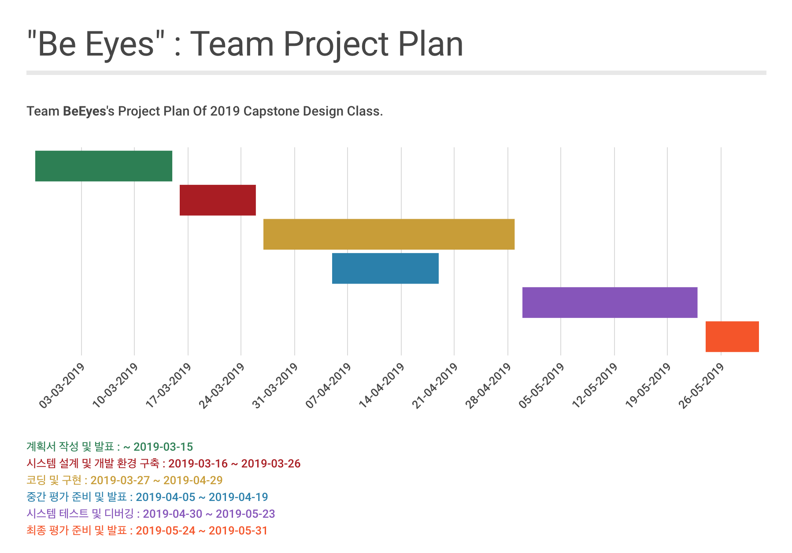

팀 소개 페이지 : https://kookmin-sw.github.io/2019-cap1-2019_6/

## 국민대학교 캡스톤 디자인 6조 팀명 : Team ViewTopia


## 프로젝트명 : Be Eyes


***

### 1. 프로젝트 소개

**시각장애인**을 위한 스마트 글래스  

국가 통계 포털의 통계 자료에 의하면, 2017년도 기준 대한민국에 있는 시각장애인의 수는 약 25만명으로 전체 인구 수인 약 5147만명 중 약 0.5%에 해당한다. 또한 전체 장애 인구의 약 10%를 차지한다. 수 많은 시각 장애인의 편리한 일상생활을 위해 다양한 이용 수단 및 장비가 제공되고 있지만 비싼 가격과 낮은 효율성과 사용성으로 시각장애인의 일상은 불편함의 연속이다. 여전히 보행의 불편함 또는 의약품 오남용 등 시각장애인을 위한 현실은 미비하다.


```markdown
  본 프로젝트는 시각장애인들이 안전하게 일상생활을 할 수 있도록 주변의 물체 및 텍스트를 인식하여 음성으로 전달해주는 스마트 안경을 개발하는 것을 목표로 한다. 
 
  1) 시각장애인 전방의 장애물의 정보를 알려준다. 장애물의 물체 정보를 인식하므로 시각 장애인은 상황에 따른 구체적인 대처가 가능하다.  
  예: 볼라드, 계단 등 
 
  2) 시각 장애인이 손가락으로 가리키는 영역의 문구를 음성으로 전달한다. 텍스트의 정보를 인식한 시각장애인은 안전한 약 복용 및 음식 섭취가 가능하다. 
  예: 약 표시 정보, 식료품 (우유, 과자봉지) 등
 
 위 2가지 기능을 통하여 시각장애인들의 안전한 일상생활에 도움이 되고자 한다. 
```

***

### 2. Abstract

 'Be Eyes' is a deep learning-based smart glass for people who are visually impaired. This project aims to develop smart glasses that recognize the surrounding objects and texts, and transmit them by voice so that blind people can safely live their daily lives. It has two main functions. 

 First, 'Be Eyes' informs the information of the obstacle to people with visual impairment. Since the information of the obstacle is recognized, they can cope with the specific situation.(Ex: bollard, stairs, etc.)

 Second, it speaks the text of the area people with visual impairment indicated by the finger. So they can take safe medications and foods. (Ex: information about drug indication, food(milk, pastry bag), etc.) 

 Through these two functions, we want to help people with visual impairment in their daily life.


### 3. 소개 영상

[](https://www.youtube.com/watch?v=_QFApkQEyH4&feature=youtu.be)
###### 이미지를 클릭하시면 영상을 보실 수 있습니다.
***

### 4. 팀 소개

#### 지도 교수 : 이 시 윤 ( Sheayun Lee )

#### 팀장 : **박 병 훈 ( Byunghoon Park )**


```markdown
학번 : 20143062
역할 : 프로젝트 팀장 및 Data 처리 훈련, Object Detection & Tracking
Email : byunghoonpark1005@gmail.com
```

#### 팀원 : **김 상 민 ( Sangmin Kim )**


```markdown
학번 : 20132368
역할 : Data 처리 훈련, Object Detection & Tracking
Email : ksm372510@gmail.com
```

#### 팀원 : **안 은 영 ( Eunyoung Ahn )**


```markdown
학번 : 20143075
역할 : Text Reading하기 위한 모션 인식 설정, TTS 기능 구현
Email : any218@kookmin.ac.kr
```

#### 팀원 : **서 준 교 ( Junkyo Seo )**


```markdown
학번 : 20143068
역할 : Text Reading하기 위한 모션 인식 설정, TTS 기능 구현
Email : jkseo50@gmail.com
```

#### 팀원 : **이 옥 걸 ( Yujie Lee )**


```markdown
학번 : 20163142
역할 : 라즈베리파이 환경 설정 및 하드웨어 디바이스 제작
Email : li994885943@gmail.com
```

***

### 5. 사용법

제작한 디바이스인 스마트 글라스를 장착한다.

* 사물 인식 기능 - 카메라가 객체를 인식하도록 장애물에 접근한다.

* 모션 인식 기능 - 글자를 읽고 싶다면 글자가 있는 곳에 검지를 들어 가리킨다.

***

### 5. 기타

> 개발 일정 (Made by Infogram)

[](https://infogram.com/capstone_design_2019_6-1h0r6rwmlzg34ek?live)
