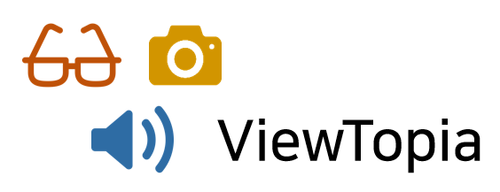
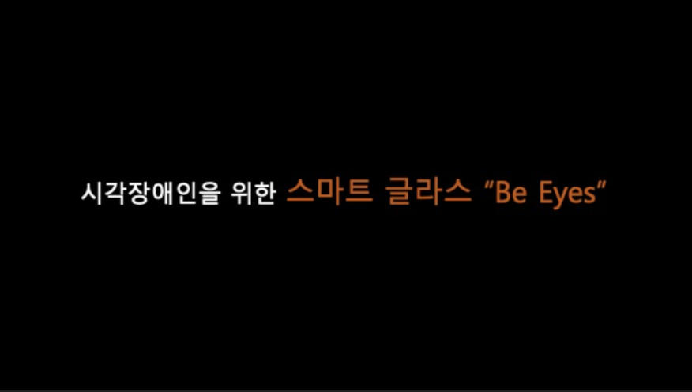
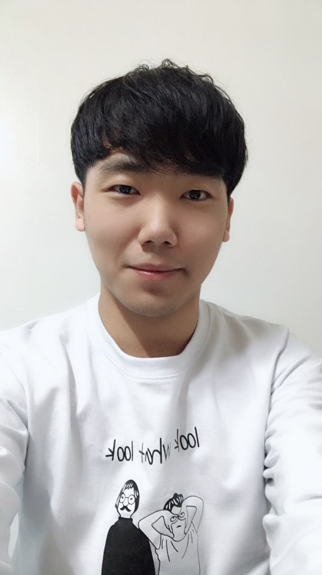

## 국민대학교 캡스톤 디자인 6조 Team ViewTopia



## Be Eyes


***

### 1. 프로잭트 소개

**시각장애인**을 위한 **딥러닝** 기반 스마트 글래스  

```markdown
  본 프로젝트는 시각장애인들이 안전하게 일상생활을 할 수 있도록 
  주변의 물체 및 텍스트를 인식하여 음성으로 전달해주는 스마트 안경을 개발하는 것을 목표로 한다.

  1) 시각장애인 전방의 장애물의 정보를 알려준다. 예: 볼라드

  2) 모션 인식을 통해서 시각장애인이 가리키는 문구를 음성으로 출력한다. 
  예: 약 표시 정보, 식료품 (우유, 과자봉지) 등


  위 2가지 기능을 통하여 시각장애인들의 안전한 일상생활에 도움이 되고자 한다. 
```

***

### 2. 소개 영상

[](https://www.youtube.com/watch?v=kQOd4qONANw&t=3s)
###### 이미지를 클릭하시면 영상을 보실 수 있습니다.
***

### 3. 팀 소개

#### 지도 교수 : 이 시 윤 교수님

#### 팀장 : **박 병 훈**


```markdown
학번 : 20143062
역할 : 프로젝트 팀장 및 Data 처리 훈련, Object Detection & Tracking
Email : byunghoonpark1005@gmail.com
```

#### 팀원 : **김 상 민 ( Sang-Min, Kim )**


```markdown
학번 : 20132368
역할 : Data 처리 훈련, Object Detection & Tracking
Email : ksm372510@gmail.com
```

#### 팀원 : **안 은 영**


```markdown
학번 : 20143075
역할 : Text Reading하기 위한 모션 인식 설정, TTS 기능 구현
Email : any218@kookmin.ac.kr
```

#### 팀원 : **서 준 교**


```markdown
학번 : 20143068
역할 : Text Reading하기 위한 모션 인식 설정, TTS 기능 구현
Email : jkseo50@naver.com
```

#### 팀원 : **이 옥 걸**



```markdown
학번 : 20163142
역할 : 라즈베리파이 환경 설정 및 하드웨어 디바이스 제작
Email : li994885943@gmail.com
```

***

### 4. 사용법

* 제작한 하드웨어 디바이스인 스마트 글라스를 장착한다.

* 카메라가 객체를 인식하도록 장애물에 접근한다.

* 글자를 읽고 싶다면 글자가 있는 곳에 특정 모션을 취한다.

***

### 5. 기타

> 개발 일정 (Made by Infogram)

[](https://infogram.com/capstone_design_2019_6-1h0r6rwmlzg34ek?live)