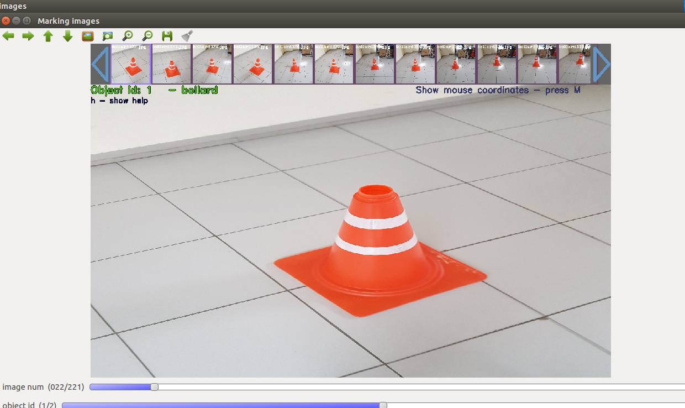
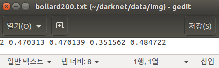
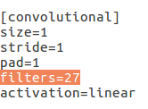
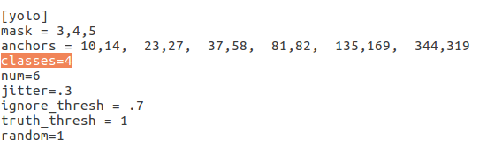
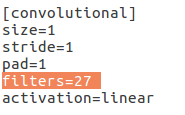
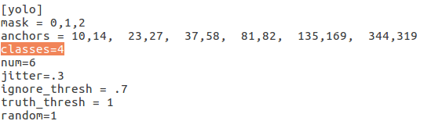
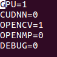
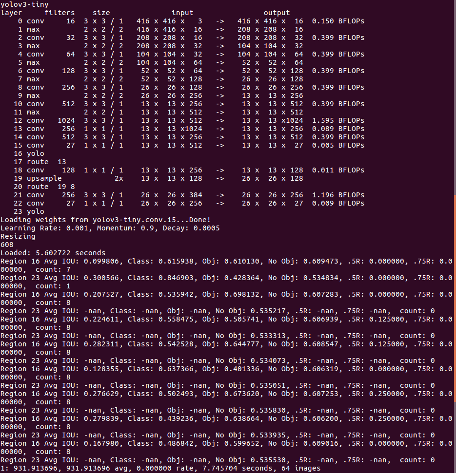
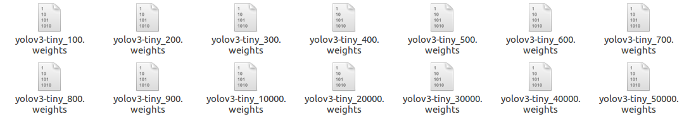

# YOLO 모델에 데이터 학습시키기

사용자가 데이터를 추가적으로 학습시키기 원한다면, 다음과 같은 과정이 필요하다. (학습을 진행한 환경은 Ubuntu 16.04 LTS이다.)
***

## 1. 데이터 수집 

학습시키기 원하는 object를 카메라를 이용하여 여러 장 촬영한다. 이때, **배경, 각도**를 다양하게 하여 촬영을 하면 더 높은 인식률을 기대할 수 있다.
수집해야 할 이미지의 양은 object의 종류에 따라서 달라지는데, 보통 한 object당 100장에서 1500장까지 수집한다.
***

## 2. Yolo mark를 통한 데이터 전처리 

### Yolo mark 설치
Yolo mark는 촬영된 이미지 데이터에서 인식하고자 하는 object의 영역에 대한 boundary의 정보를 추출해주는 프로그램이다. 
해당 명령어를 terminal에서 실행하면, Yolo mark가 설치된다. 
```markdown
git clone https://github.com/AlexeyAB/Yolo_mark
```
설치가 완료되면 yolo-mark 디렉토리로 이동 후 make한다.
다음 명령어를 순서대로 terminal에 입력한다.
```markdown
cmake .
make
```
### Labeling 작업
이제 이미지 데이터의 object 정보를 추출하는 라벨링 작업을 진행한다.
```markdown
yolo_mark/x64/Release/data/img
```
다음 경로에 기존에 있던 이미지 파일들을 삭제한다. 그리고 해당 폴더에 새로 수집한 이미지 파일(JPG)을 넣어준다.
그 뒤, yolo_mark/x64/Release/data/ 경로에 있는 obj.data 파일을 수정한다.
```markdown
yolo_mark/x64/Release/data
vi obj.data
```
obj.data 파일을 열게 되면, 다음과 같은 정보가 나오게 된다.
```markdown
classes= 2
train = data/train.txt
valid = data/train.txt
names = data/obj.names
backup = backup/
```
여기서, classes는 분류하고자 하는 object의 종류의 수를 의미한다. 본 프로젝트에서는 볼라드, 계단, 소화기, 손가락을 학습시켰으므로, classes= 4로 설정하였다. 나머지 부분은 그대로 두고 수정한 내용을 저장한다.
***
다음에는, obj.names 파일을 수정한다.
```markdown
yolo_mark/x64/Release/data
vi obj.names
```
obj.names 파일을 열게 되면, 다음과 같은 정보가 나온다.
```markdown
airplane
bird
```
해당 파일은 분류할 object에 대해 각각 이름을 지정해준다. object id는 위부터 0, 1, 2 ... 순으로 매핑된다. 해당 폴더의 내용을 수정한 후 저장한다. 
그 다음, 해당 디렉토리에 있는 train.txt 폴더에 라벨링할 이미지 파일의 경로를 모두 적어준다.
```markdown
ex) x64/Release/data/img/stair001.JPG
```
파일 작성이 끝났으면, x64/Release/yolo_mark 디렉토리로 이동하여 yolo mark를 실행시킨다.
```markdown
./linux_mark.sh
```
이제부터 bounding box를 직접 마우스로 그려넣어 라벨링을 진행한다.



라벨링을 하면, jpg 파일 옆에 txt 파일이 생성된다.



해당 txt 파일에는 object id와 bounding box의 중심 좌표값과 너비, 높이가 기록된다.

## 3. 데이터 학습

데이터 학습 진행을 위해, yolo_mark/x64/Release 경로로 이동한다.
그리고, yolov3-tiny.cfg 파일을 수정한다.
```markdown
vi yolov3-tiny.cfg
```
cfg 파일은 yolo의 신경망 모델의 구조와 hyper parameter를 담고 있다. 해당 파일에서, 학습시키고자 하는 object의 종류에 따라 filter수가 달라지므로, object 종류에 맞게 filter를 변경해주어야 이상없이 학습이 진행된다. 해당 폴더에서 값을 변경해야 할 변수는 classes와 filter이다.



해당 cfg 파일의 127행, 135행, 171행, 177행의 값을 맞게 변경해주어야 한다.
classes에는 분류할 object의 종류의 수를 입력하고, filter에는 (classes + coords + 1) * num의 값을 입력해야 한다.
본 프로젝트에서는 4개의 class를 학습시킬 때 filter를 27로 설정하였다. (classes = 4, coords = 4, num = 3)
### Darknet YOLO 설치 및 setting
이제, yolo를 설치하여 본격적으로 학습을 진행한다. 먼저, yolo를 설치하기 전에 OpenCV를 먼저 설치해야 한다. 이 가이드에서는 OpenCV 설치에 관한 내용은 생략한다. (본 프로젝트에서는 OpenCV 3.2 버전을 설치하였다.)
먼저, 해당 명령어를 통해 Darknet YOLO를 다운받는다.
```markdown
git clone https://github.com/pjreddie/darknet
```
그리고, CUDA와 OpenCV의 사용을 위해 해당 경로의 Makefile를 열어 값을 수정한다.
```markdown
vi Makefile
```


GPU를 통한 데이터 학습을 위해 GPU=1, 웹캠 및 yolo mark 실행을 위해 OPENCV=1로 각각 변경한다.
수정된 값을 저장하고, make를 한다.
```markdown
cd darknet
make
```
### convolutional layer 설치
학습을 위한 darknet YOLO의 설치는 모두 마무리되었다. 이제, darknet 디렉토리 안에 tiny yolo v3의 convolutional layer를 설치한다.
```markdown
https://pjreddie.com/media/files/yolov3-tiny.weights
```
그 뒤, 다음 명령어를 실행하여 weight를 추출한다.
```markdown
./darknet partial cfg/yolov3-tiny.cfg yolov3-tiny.weights yolov3-tiny.conv.15 15
```
이 명령어를 통하여, 학습에 필요한 yolov3-tiny.conv.15 파일을 얻을 수 있다.

### 파일 경로 이동
yolo-obj.cfg 파일도 darknet 디렉토리로 이동시키고, yolo_mark/x64/Release/data 경로 안에 있는 image 디렉토리와 obj.names, obj.data, train.txt를 darknet/data 경로로 이동시켜준다. 여기서 주의할 점은, train.txt에 있는 파일 경로의 x64/Release 부분을 지워준다.
```markdown
ex) x64/Release/data/img/stair001.JPG => data/img/stair001.JPG
```

### 데이터 학습 진행
경로 설정이 모두 완료되었으니 이제 데이터 학습을 진행한다.
다음 명령어를 darknet 디렉토리에서 실행하면 학습이 진행된다.
```markdown
./darknet detector train data/obj.data cfg/yolov3-tiny.cfg yolov3-tiny.conv.15
```
만약 tiny yolo v3 모델이 아닌 다른 모델을 이용하여 학습하고 싶다면 yolov3-tiny.cfg 와 yolov3-tiny.conv.15을 다른 모델로 대체할 수 있다.



학습이 진행되면, 학습 횟수, 손실 함수 값, 학습률, 걸린 시간, 학습된 총 이미지 파일의 수가 terminal에 로그로 기록되는 것을 확인할 수 있다.
또, 학습이 진행되면 100, 200, ..., 900 단위로 weights 파일이 생성되며, 그 뒤로는 10000번 학습할 때마다 weights 파일이 기록된다.



중간에 학습을 중단하더라도 해당 weights 파일을 통해 해당 지점부터 다시 학습을 진행할 수 있다. (darknet/backup 경로에 weights 파일이 기록된다.)
학습을 진행함에 있어서 가장 중요한 것은 overfitting이 일어나기 전까지 학습을 시키는 것인데, 손실 함수값의 증감을 통해 overfitting 여부를 확인할 수 있다. 손실 함수값이 최저가 되었을 때의 weights 파일을 사용하는 것이 가장 좋은 인식률을 보인다.
